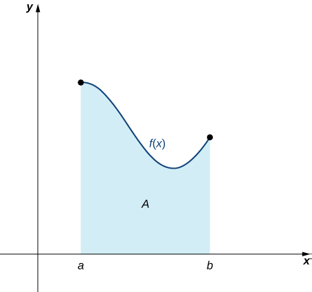

# 5.1_ Approximating Areas - Mathematics LibreTexts.pdf

**Caption from CLIP model**: figure is described in the surrounding text. (0)

**Enhanced caption**: Figure illustrating the shaded region bounded by a continuous, nonnegative function \( f(x) \) at the top, the x-axis at the bottom, and the vertical lines \( x = a \) and \( x = b \) on the sides. This area is essential for approximating the area under the curve. (1)

**Time used**: 3.099276065826416 s

**Caption from CLIP model**: the diagram below shows the slope of the line. (0)

**Enhanced caption**: The diagram below shows the slope of the line in the context of a left-endpoint approximation of area under a curve using subintervals. (0.75)

**Time used**: 2.007870674133301 s

**Caption from CLIP model**: a diagram of a line graph. (0.5)

**Enhanced caption**: A diagram of a line graph illustrating the right-endpoint approximation for area under a curve, with rectangles formed based on the function value at the right of each subinterval. (0.75)

**Time used**: 1.8757526874542236 s

**Caption from CLIP model**: the slope of the line. (0)

**Enhanced caption**: The slope of the line represents the right-endpoint approximation of the area under a curve, as illustrated in the figure showing methods of approximating this area. (0.5)

**Time used**: 2.1193814277648926 s

**Caption from CLIP model**: diagram of a line of descent. (0)

**Enhanced caption**: Diagram of a line of descent illustrating the left-endpoint approximation of the area under a curve from one point to another. (0.5)

**Time used**: 2.1296746730804443 s

**Caption from CLIP model**: a diagram of the relationship between time and number. (0)

**Enhanced caption**: A diagram illustrating the right-endpoint approximation of the area under a curve. The graph displays the relationship between time and number, showing approximate values. (0.5)

**Time used**: 4.678425073623657 s

**Caption from CLIP model**: the slope of the intercept. (0)

**Enhanced caption**: The caption "the slope of the intercept" refers to the calculations involved in estimating the area under a curve using left-endpoint and right-endpoint approximations. The image illustrates how these approximations become more accurate with an increased number of intervals, as noted in the source document. (0.25)

**Time used**: 2.8630144596099854 s

**Caption from CLIP model**: the slope of a number is. (0)

**Enhanced caption**: The caption refers to the concept of slope in relation to approximating areas under a curve with rectangles in a mathematical context. The area under the curve is approximated using both left-endpoint methods and by dividing the region into four and eight intervals. (0.5)

**Time used**: 2.807055950164795 s

**Caption from CLIP model**: figure is a-line graph of the number of units of energy. (0)

**Enhanced caption**: The figure is an A-line graph showing the number of units of energy, divided into eight subintervals to compare the approximation of area under the curve using rectangles. It illustrates the reduction in white space when using eight rectangles compared to four. (0.25)

**Time used**: 3.4247453212738037 s

**Caption from CLIP model**: the slope of the line. (0)

**Enhanced caption**: The slope of the line on the graph represents area approximations calculated with rectangles inscribed under the curve, indicating a left-endpoint approximation method. (0.5)

**Time used**: 7.227739095687866 s

**Caption from CLIP model**: the slope of a line. (0)

**Enhanced caption**: The slope of a line is illustrated in the context of right-endpoint approximation of a curve using four rectangles for area calculation. (0.5)

**Time used**: 2.181791305541992 s

**Caption from CLIP model**: figure : a line graph of the number of new jobs created. (0)

**Enhanced caption**: A line graph of the number of new jobs created, related to the right-endpoint approximation for a region divided into subintervals. (0.25)

**Time used**: 2.0132133960723877 s

**Caption from CLIP model**: figure is a plot of the number of customers. (0)

**Enhanced caption**: The figure is a plot illustrating the right-endpoint approximation of the area under a curve, showing a close estimate as the number of subintervals increases. This approximation improves as more rectangles are used, suggesting more accurate area calculations. (1)

**Time used**: 2.4870951175689697 s

**Caption from CLIP model**: the slope of a number. (0)

**Enhanced caption**: The slope of a number from the graph representing a right-endpoint approximation of the area bounded by the curve and the x-axis on [a, b], showing a lower sum for the Riemann sum. (0.5)

**Time used**: 3.3419687747955322 s

**Caption from CLIP model**: a plot of the number of triangles. (0)

**Enhanced caption**: A plot of the number of triangles is shown, likely relating to the context of finding lower and upper sums in mathematical analysis. (0)

**Time used**: 1.732470989227295 s

**Caption from CLIP model**: the slope of a line. (0)

**Enhanced caption**: The slope of a line in the graph representing a mathematical function. The graph is divided into six regions to analyze the area of interest over a specified interval. (0.5)

**Time used**: 2.270517349243164 s